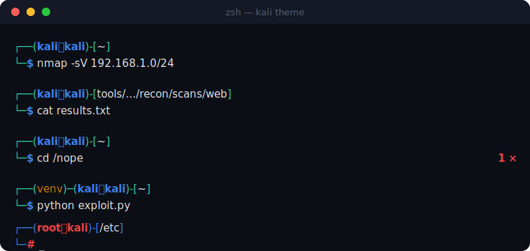

<div align="center">

# kali-zsh-theme

**把 Kali Linux 那个标志性的双行提示符，搬到任意系统的 [Oh My Zsh](https://ohmyz.sh/) 上。**

无需安装整个 Kali，一个主题文件就能拥有同款终端外观。

**简体中文** · [English](README.en.md)


<br/>



</div>

---

## 这是什么

Kali Linux 自带的 zsh 提示符长这样：

```
┌──(kali㉿kali)-[~]
└─$
```

它来自 Kali 官方的 [`kali-defaults`](https://gitlab.com/kalilinux/packages/kali-defaults) 包。本主题把那段提示符逻辑抽出来，封装成标准的 Oh My Zsh 主题，让你在 **macOS、Ubuntu、WSL** 等任何装了 Oh My Zsh 的环境里都能用上同款外观。

## 特性

| | 说明 |
|---|---|
| 🪜 **双行提示符** | 第一行显示 `用户㉿主机` + 当前路径，第二行专门用来输入命令，长命令不挤 |
| 🔴 **root 自动变红** | 切到 root 时整行变红，`$` 变成 `#`，一眼区分权限，避免误操作 |
| 📁 **智能路径折叠** | 路径超过 6 层自动缩成 `tools/…/recon/scans/web`，深目录也不刷屏 |
| 🐍 **环境感知** | 自动识别 Python 虚拟环境 (`virtualenv`) 和 chroot，在提示符里标出 |
| ⨯ **退出码提示** | 命令失败时，右侧显示退出码与 `⨯` 标记 |
| ⚙ **后台任务数** | 有挂起的后台任务时，右侧显示 `⚙ N` |

## 安装

> 前置条件：已安装 [Oh My Zsh](https://github.com/ohmyzsh/ohmyzsh#basic-installation)。

**1. 下载主题到 Oh My Zsh 自定义主题目录**

```bash
curl -fsSL https://raw.githubusercontent.com/casperkwok/kali-zsh-theme/main/kali.zsh-theme \
  -o ~/.oh-my-zsh/custom/themes/kali.zsh-theme
```

**2. 在 `~/.zshrc` 里启用**

```bash
ZSH_THEME="kali"
```

**3. 重新加载**

```bash
source ~/.zshrc
```

完成 🎉 —— 新的终端会立刻变成 Kali 风格。

## 字体

提示符用到了框线字符 `┌ └ ─` 和 `㉿`(U+327F)。大多数现代等宽字体都能正常显示，但要获得最佳对齐效果，推荐安装 [Nerd Font](https://www.nerdfonts.com/)：

```bash
# macOS
brew install --cask font-hack-nerd-font
```

装好后在终端设置里把字体选成 `Hack Nerd Font`(或任意 Nerd Font)即可。

## 自定义

不喜欢用户名和主机名之间的 `㉿`？编辑 `~/.oh-my-zsh/custom/themes/kali.zsh-theme`，把：

```bash
prompt_symbol=㉿
```

改成你喜欢的符号，比如经典的 `@`：

```bash
prompt_symbol=@
```

保存后 `source ~/.zshrc` 即可。

## 配合插件，体验更接近 Kali

Kali 的终端体验离不开两个插件，搭配本主题食用更佳：

```bash
# macOS（Homebrew）
brew install zsh-syntax-highlighting zsh-autosuggestions
```

在 `~/.zshrc` 末尾加上：

```bash
source $(brew --prefix)/share/zsh-autosuggestions/zsh-autosuggestions.zsh
source $(brew --prefix)/share/zsh-syntax-highlighting/zsh-syntax-highlighting.zsh
```

## 卸载

把 `~/.zshrc` 里的 `ZSH_THEME="kali"` 改回你原来的主题，删掉主题文件即可：

```bash
rm ~/.oh-my-zsh/custom/themes/kali.zsh-theme
```

## 致谢

提示符逻辑来自 [Kali Linux `kali-defaults`](https://gitlab.com/kalilinux/packages/kali-defaults) 项目（GPL-3.0）。本仓库仅作整理与移植，与 Offensive Security / Kali Linux 团队无关联。

## License

[GPL-3.0](LICENSE) —— 与上游 `kali-defaults` 保持一致。
